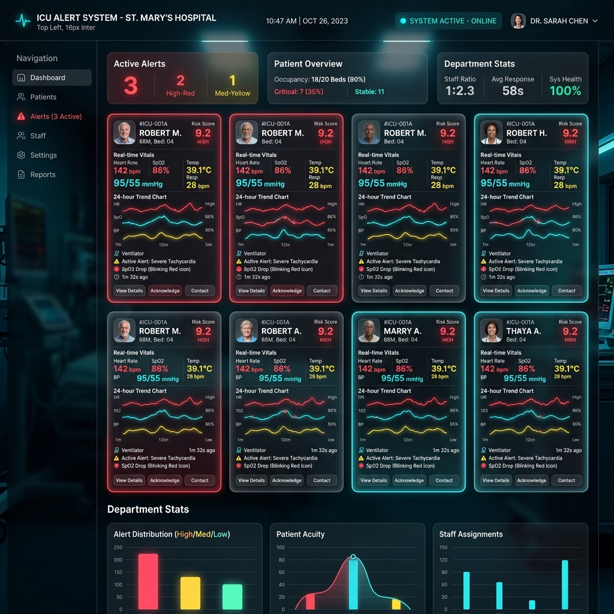
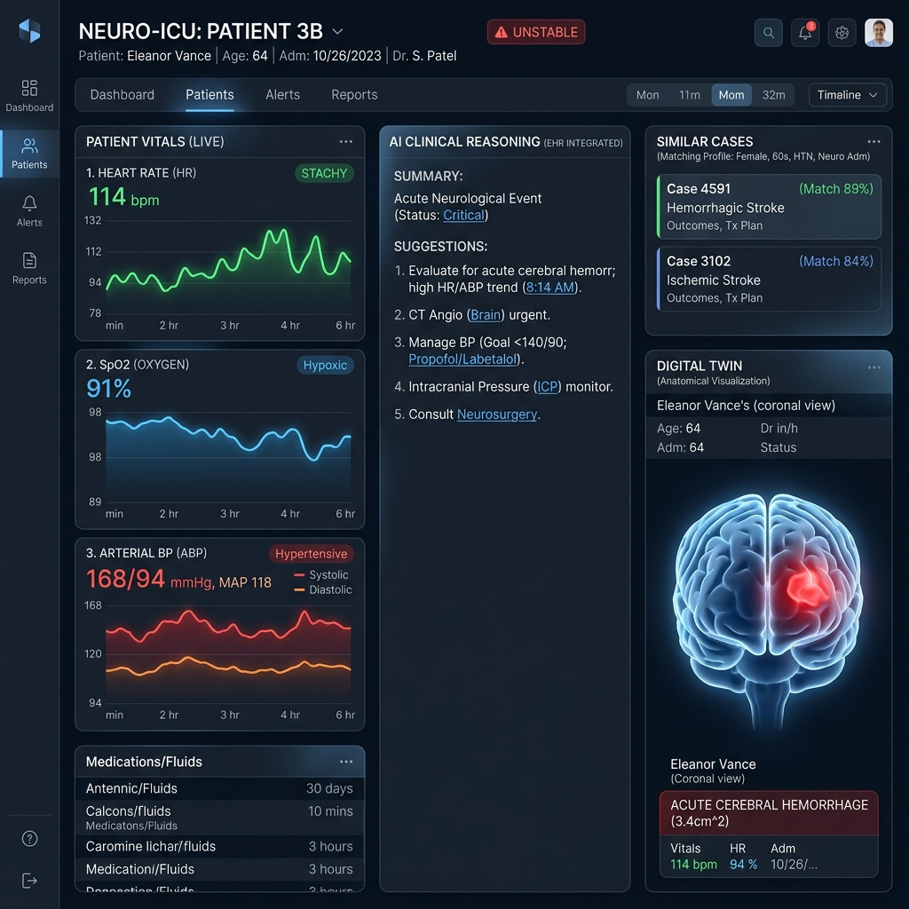

# ICU 智能预警系统 (ICU Alert System)


> **面向重症监护病区的全栈智能预警、流程监测、AI 决策支持与病区运营平台。**

---

## 🌟 项目亮点

系统将床旁监护、检验、药物执行、护理评估、设备管理、实时预警、Analytics、数字孪生、MDT 和知识库统一到同一套后端规则引擎与前端工作台中，为临床提供 24/7 的智能守护。

- **实时风险识别**：秒级处理监护与检验数据，支持 40+ 临床风险扫描器。
- **治疗过程监测**：自动化跟踪撤机、CRRT、抗菌药、镇静镇痛、VTE 预防等关键流程。
- **AI 辅助决策**：集成多模态大模型，提供临床推理、相似病例检索、交班摘要及反事实模拟。
- **数字孪生 & 万物互联**：深度整合设备参数，构建患者数字化模型，实时反馈血流动力学与呼吸动力学状态。
- **病区运营中枢**：提供大屏视图、护理工作量预测热力图及病区风险态势感知。

---

## 📸 界面预览

````carousel

<!-- slide -->

````

---

## 🛠️ 技术栈

- **后端**: FastAPI (Python 3.10+), Redis (任务队列), MongoDB (结构化/非结构化数据)
- **前端**: Vue 3, Vite, Ant Design Vue, ECharts (可视化)
- **引擎**: 自研 AlertEngine (Mixin 架构), PopPK 药代动力学引擎
- **AI**: LLM (Qwen, GPT等), RAG (知识检索), Vector Store
- **部署**: Docker Compose, PyInstaller (EXE), Linux Binary

---

## 🚀 快速开始

### 1. 克隆并安装依赖

```bash
# 后端
cd backend
python -m pip install -r requirements.txt

# 前端
cd frontend
npm install
```

### 2. 配置文件

复制 `example.env` 为 `.env` 并填写数据库与 LLM 信息：
```env
LLM_API_KEY=your_key_here
SMARTCARE_DB_HOST=127.0.0.1
REDIS_HOST=127.0.0.1
```

### 3. 运行服务

```bash
# 启动 API 服务
cd backend
python -m uvicorn app.main:app --reload

# 启动扫描 Worker (独立进程)
python run_scan_worker.py

# 启动前端
cd frontend
npm run dev
```

---

## 🐳 容器化部署

使用 Docker 一键启动完整环境：

```bash
docker-compose up -d
```

---

## 📦 打包与分发

项目支持多种打包方式以适应离线部署环境：

- **Windows EXE**: 执行 `.\build_exe.ps1`
- **Linux Binary**: 执行 `./build.sh`
- **OEL8 特供版**: 执行 `.\build_oel8.ps1`

详细打包说明请参考 [EXE_BUILD.md](file:///d:/icu-alert-system/EXE_BUILD.md) 和 [LINUX_BINARY_BUILD.md](file:///d:/icu-alert-system/LINUX_BINARY_BUILD.md)。

---

## 🧠 核心规则逻辑

系统中包含 40 余种临床扫描器，其详细的触发逻辑、计算公式及严重度定义请参阅：

👉 **[扫描器与计算口径详解 (SCANNERS.md)](file:///d:/icu-alert-system/SCANNERS.md)**

---

## ⚙️ 环境变量配置清单

| 变量名 | 默认值 | 说明 |
| --- | --- | --- |
| `SMARTCARE_DB_HOST` | `127.0.0.1` | SmartCare 数据库地址 |
| `REDIS_HOST` | `127.0.0.1` | Redis 地址 (用于任务队列) |
| `LLM_MODEL` | `qwen2.5:32b` | 主模型选择 |
| `LLM_BASE_URL` | - | LLM API 接口地址 |
| `SECRET_KEY` | - | 应用通信密钥 |

---

## 📄 许可证

Copyright © 2026 ICU Alert System Team. All rights reserved.
