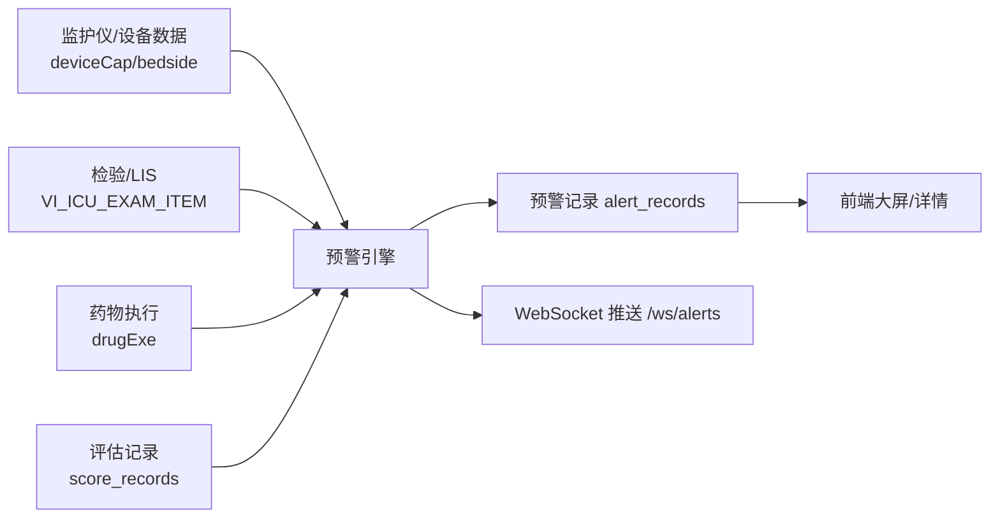

# ICU智能预警系统（ICU Alert System）

面向重症监护（ICU）的全栈智能预警平台，覆盖多数据源采集、规则引擎、趋势分析、综合征识别、护理提醒与 AI 辅助决策。

## 架构概览



## 预警引擎总览（13个扫描模块）

| 模块 | 扫描周期 | 规则数 | 覆盖范围 |
|---|---|---|---|
| `vital_signs.py` | 60s | 11 | HR / SpO₂ / T / SBP / RR 阈值（种子规则） |
| `lab_scanner.py` | 300s | 20 | K⁺/Na⁺/iCa/Lac/Glu/Hb/PLT/Cr/PCT/INR/Trop/BNP |
| `trend_analyzer.py` | 900s | 6 | HR/SpO₂/RR/SBP/T 持续恶化（线性回归） |
| `syndrome_sepsis.py` | 300s | 3 | Sepsis-3：qSOFA / SOFA Δ / 脓毒性休克 |
| `syndrome_ards.py` | 300s | 3 | ARDS Berlin 分级（P/F + PEEP） |
| `syndrome_aki.py` | 600s | 3 | AKI KDIGO 分期（Cr + 尿量） |
| `syndrome_dic.py` | 900s | 2 | ISTH DIC 评分（疑似/显性） |
| `syndrome_tbi.py` | 300s | 4 | ICP/CPP/GCS变化/瞳孔异常 |
| `syndrome_bleeding.py` | 600s | 3 | Hb 下降 + HR/SBP/诊断标签 |
| `ventilator.py` | 3600s | 1 | 撤机筛查（SBT 评估） |
| `drug_safety.py` | 1800s | 4 | HIT / 万古霉素肾毒性 / 过度镇静 / QT 风险 |
| `nurse_reminder.py` | 600s | 4 | GCS/RASS/疼痛/谵妄评估超时 |
| `ai_risk.py` | 1800s | 1 | LLM 结构化风险评估 |

> 规则总数 40+（当前约 65 条），可按科室需求继续扩展。

## 关键数据源

- **监护设备**：`SmartCare.deviceCap`、`SmartCare.bedside`
- **检验**：`DataCenter.VI_ICU_EXAM_ITEM`
- **药物执行**：`SmartCare.drugExe`
- **评估量表**：`SmartCare.score_records`
- **预警记录**：`SmartCare.alert_records`

## 安装与部署

### 1. 环境准备

- Python 3.11+
- Node.js 18+
- MongoDB 4.4+
- Redis（可选）

### 2. 后端启动

```bash
cd backend
copy .env.example .env
pip install -r requirements.txt
python -m uvicorn app.main:app --host 0.0.0.0 --port 8000
```

### 3. 前端启动

```bash
cd frontend
npm install
npm run dev -- --host 0.0.0.0 --port 5173
```

### 4. 一键脚本（Windows）

- `run-dev.bat`：前后端 + 自动安装依赖
- `run-dev-fast.bat`：快速启动（不安装依赖）
- `run-dev-open.bat`：快速启动 + 自动打开浏览器

## 环境变量说明

见 `backend/.env.example`，主要包括：

- 数据库：`SMARTCARE_DB_*`、`DATACENTER_DB_*`
- Redis：`REDIS_HOST` / `REDIS_PORT`
- LLM：`LLM_BASE_URL` / `LLM_API_KEY` / `LLM_MODEL` / `LLM_MODEL_MEDICAL`
- 系统：`SECRET_KEY`

## API 接口

- `GET /health` 健康检查
- `GET /api/departments` 科室列表
- `GET /api/patients` 在院患者
- `GET /api/patients/{id}` 患者详情
- `GET /api/patients/{id}/vitals` 当前生命体征
- `GET /api/patients/{id}/vitals/trend` 生命体征趋势
- `GET /api/patients/{id}/labs` 近期检验
- `GET /api/patients/{id}/drugs` 用药记录
- `GET /api/patients/{id}/assessments` 评估记录
- `GET /api/patients/{id}/alerts` 预警历史
- `GET /api/alerts/recent` 最新预警
- `GET /api/alerts/stats` 预警趋势
- `GET /api/ai/lab-summary/{id}` AI 检验摘要
- `GET /api/ai/rule-recommendations/{id}` AI 规则推荐
- `GET /api/ai/risk-forecast/{id}` AI 风险预测
- `WS /ws/alerts` 预警实时推送

## 预警规则扩展

- 规则种子：`alert_rules`（MongoDB）
- 医院本地指标映射：`backend/config.yaml`
- 可按医院编码扩展字段映射与药物列表

---

如需完整临床落地支持（基线计算优化、药物剂量解析、血气接口对接），请联系维护团队。