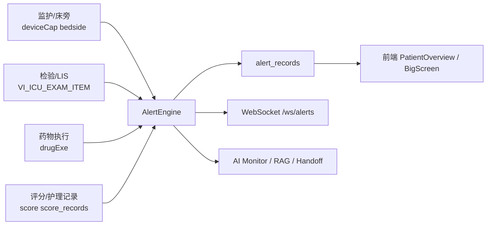

# ICU智能预警系统（ICU Alert System）

面向重症监护病房（ICU）的全栈智能预警平台，整合 **监护设备、检验、药物执行、护理评分、AI 分析**，用于实现实时预警、临床联动与病区可视化。

## 项目亮点

- **多源数据接入**
  - SmartCare：`patient` / `bedside` / `deviceCap` / `drugExe`
  - DataCenter：`VI_ICU_EXAM_ITEM`
- **面向 ICU 抢救场景的综合预警**
  - 不只报“单个阈值超限”，而是输出 **综合预警卡 / 病理生理链 / 微型上下文快照**
  - 支持在预警卡上直接看到 **HR / RR / MAP / SpO₂ / T、关键检验、血管活性药**
- **规则引擎 + 临床综合征识别**
  - 脓毒症、ARDS、AKI、DIC、出血、撤机、VTE、CRRT、谵妄、PE、术后并发症、心脏骤停前风险等
- **床旁与病区双视角**
  - 患者详情页、检验时间线、大屏态势、Analytics、Bundle 合规看板、床位 hover 摘要
- **AI 辅助**
  - 风险预测、AI 交班摘要（I-PASS / ISBAR）、Explainability 三段式解释、离线知识检索（RAG）、调用质量监控
- **可落地安全与工程能力**
  - WebSocket 鉴权、CORS 白名单、扫描错峰、全局并发控制、单元测试

### 为什么这套系统更适合 ICU 一线使用

- **更少误报**：开始引入个体基线、数据质量过滤、多参数联合确认，降低“电极脱落 / 探头偏移 / 单点噪声”带来的伪报警
- **更接近临床决策**：从“规则命中列表”升级为 **结论 + 证据 chips + 处置建议**
- **更适合值班视角**：大屏、总览、详情页全部统一成 **ICU 中控 / 监护大屏皮肤**
- **更利于质控闭环**：支持 Sepsis 1h Bundle、SBT 结构化记录、再插管风险、相似病例结局统计
- **更容易扩展到院内落地**：规则阈值、关键词、扫描周期、药物识别均可通过 `config.yaml` 调整

---

## 系统架构



---

## 当前核心能力

### 1）生命体征与趋势
- HR / RR / SpO₂ / 血压 / 体温阈值预警
- 趋势恶化识别（急性/亚急性趋势增强）
- 数据质量过滤（设备信号异常 / 生理不合理值过滤）
- 个体基线偏离识别（absolute threshold + baseline deviation）
- 心律/QTc/容量反应性/呼吸机参数联动

### 2）检验与酸碱分析
- 电解质、乳酸、Hb、PLT、Cr、PCT、INR、BNP、肌钙蛋白等扫描
- 血气自动解读：
  - 主紊乱判断
  - Winter 代偿判断
  - 校正 AG
  - Delta-Delta
  - 乳酸校正 AG
  - **呼吸性酸碱中毒急慢性区分**
  - **Stewart SID 分析**

### 3）综合征识别
- **Sepsis-3**：qSOFA / SOFA Δ / 脓毒性休克
- **ARDS**：P/F + PEEP
- **AKI**：KDIGO（Cr + 尿量）
- **DIC**：ISTH
- **出血风险**
- **谵妄风险 / CAM-ICU 阳性**
- **急性肺栓塞（PE）模式识别 + Wells 评分**
- **术后出血 / 感染二次高峰 / 肠麻痹**
- **心脏骤停前高风险识别**
- **休克链 / 呼衰链 / 脓毒症进展链等临床推理链**

### 4）治疗过程监测
- 呼吸机撤机与呼吸力学监测
- **SBT 结构化记录时间线**
- **拔管后再插管高风险识别**
- **液体过负荷与去复苏时机提示**
- CRRT：
  - TMP 趋势
  - ACT / 枸橼酸抗凝监测
  - 剂量不足
  - **滤器时长**
  - **Ca_total / iCa 比值**
  - **电解质复查提醒**
- 药物安全：
  - HIT
  - QT 风险
  - 镇静/阿片相关风险
  - 激素撤离/减停/血糖联动
- 剂量调整：
  - 肾功能不全高危药
  - **肝功能不全高危药**
- **抗生素药敏覆盖不足 / MDRO / TDM 强化提醒**

### 5）护理与流程合规
- GCS / RASS / 疼痛 / CAM-ICU / Braden 超时提醒
- **eCASH 闭环**：
  - Analgesia / Sedation / Delirium 三维实时灯态
  - SAT 提醒
  - 苯二氮卓使用警示
- Device management：
  - CVC / Foley / ETT 在位日和必要性评估
- Liberation bundle：
  - A-F Bundle 合规检查
- **ICU-AW 风险与早期活动等级推荐**
- 转出准备评估：
  - **API 查询 + 主动推送**

### 6）AI 能力
- AI 检验摘要
- AI 规则推荐
- AI 恶化风险预测（历史风险 + 未来预测）
- AI 交班摘要（I-PASS / ISBAR）
- **AI 归因摘要**
  - 当患者 30 分钟内累计多条活跃报警时，自动汇总近期报警、生命体征、检验、护理上下文
  - 输出共同根因、最紧急 action、优先级排序、建议合并展示方案
- **个性化报警阈值建议**
  - 基于 24-72h 生命体征分布、诊断背景、血管活性药/镇静药状态生成医生审核版阈值建议
  - `pending_review -> approved / rejected` 审核闭环，默认不自动生效
- **增强 Similar Case Review**
  - 诊断 embedding + 余弦相似度匹配
  - Top-5 相似病例结局 / ICU 天数 / 干预方案的结构化 LLM 解读
- AI 预警 Explainability：
  - `summary / evidence / suggestion`
  - 轻量 LLM 二次润色
- 离线知识库检索（RAG）
- **AI 调用监控**
  - hash / latency / success
  - token usage
  - 日聚合统计
  - 成功率/P95 告警
- **降级与韧性**
  - LLM fallback model
  - circuit breaker
  - 前端 “AI服务降级中” 状态灯
  - Similar Case Review / PatientDetail / BigScreen 的 timeout 与接口失败降级展示

### 7）前端临床可视化
- **综合预警卡**
  - 三段式展示：Summary / Evidence / Suggestion
  - 聚合主题（aggregated_groups）
  - 临床链（clinical_chain）
- **抢救期风险卡**
  - PatientOverview 主卡 / hover drawer
  - BigScreen 告警流 / 床位卡 / hover 展开态
  - PatientDetail hero 红色结论条
- **Analytics 中控视图**
  - 顶部 KPI strip
  - Sepsis 1h Bundle 合规率
  - 脱机失败高风险占比 / 再插管风险
- **相似病例结局回溯**
  - ICU 天数、呼吸机天数、存活率、转归统计
- **AI 归因与阈值审核卡片**
  - 预警历史页展示 “AI 归因摘要”
  - 个性化报警阈值建议支持默认阈值偏移对比、审核弹窗、当前生效版本提示

---

## 预警引擎模块

当前后端已包含以下主要模块：

| 模块 | 作用 |
|---|---|
| `vital_signs.py` | 生命体征阈值预警 |
| `lab_scanner.py` | 检验扫描与纠正建议 |
| `trend_analyzer.py` | 生命体征趋势恶化 |
| `data_quality_filter.py` | 数据可信度过滤 / 设备异常识别 |
| `syndrome_sepsis.py` | Sepsis-3 / 脓毒性休克 |
| `syndrome_ards.py` | ARDS 识别 |
| `syndrome_aki.py` | AKI 分期 |
| `syndrome_dic.py` | DIC 评分 |
| `syndrome_tbi.py` | ICP / CPP / GCS / 瞳孔 |
| `syndrome_bleeding.py` | 出血识别 |
| `ventilator.py` | 撤机与呼吸机力学监测 |
| `cardiac_arrest_predictor.py` | 心脏骤停前高风险识别 |
| `pe_detector.py` | 急性肺栓塞模式识别 |
| `postop_monitor.py` | 术后并发症监测 |
| `drug_safety.py` | 药物不良反应与联动规则 |
| `antibiotic_stewardship.py` | 抗菌药优化与 PCT 停药评估 |
| `microbiology_monitor.py` | 药敏覆盖 / MDRO / TDM 监测 |
| `delirium_risk.py` | 谵妄风险 / CAM-ICU |
| `device_management.py` | CVC/Foley/ETT 管路管理 |
| `fluid_balance.py` | 入量/出量/净平衡 |
| `glycemic_control.py` | 血糖波动/低血糖/复查提醒 |
| `vte_prophylaxis.py` | VTE 风险与预防遗漏 |
| `nutrition_monitor.py` | 营养不足/再喂养风险 |
| `composite_deterioration.py` | 多器官恶化趋势 |
| `alert_reasoning_agent.py` | 多报警因果归因与合并展示建议 |
| `crrt_monitor.py` | CRRT 运行监测 |
| `liberation_bundle.py` | A-F Bundle 合规 |
| `ecash_bundle.py` | eCASH 闭环状态与提醒 |
| `hemodynamic_advisor.py` | PPV/SVV 容量反应性 |
| `dose_adjustment.py` | 肾/肝功能剂量调整 |
| `discharge_readiness.py` | 转出风险评估 |
| `icu_aw_mobility.py` | ICU-AW 风险与活动等级建议 |
| `similar_case_review.py` | 相似病例结局回溯 |
| `adaptive_threshold_advisor.py` | 个性化报警阈值推荐与审核前缓存 |
| `ai_risk.py` | LLM 结构化风险分析 |
| `nurse_reminder.py` | 护理评估到期提醒 |

---

## 最近一轮重点更新

### 抢救期决策支持升级
- 新增 **综合预警卡 / 抢救期风险卡**，支持在同一张卡片上展示：
  - 当前判断
  - 2~3 条关键证据 chips
  - 医嘱式建议
  - 微型上下文快照
- 新增 **clinical_chain / aggregated_groups**，把“多个离散预警”聚合成更接近临床思维的一件事
- BigScreen、PatientOverview、PatientDetail 全部统一成 ICU 中控皮肤

### 临床准确性
- 血气解读新增：
  - 呼吸性酸碱失衡急/慢性区分
  - Stewart SID 分析
- 血糖 CV 改为 **样本标准差（N-1）**
- PCT 停药评估改为以 **抗生素疗程起始后峰值** 为基线
- CAM-ICU 阳性可直接触发 **critical**
- 开始支持 **个体基线**、**数据质量过滤**、**多参数联合确认**

### 监测增强
- CRRT 新增滤器时长、枸橼酸蓄积风险、电解质复查提醒
- VTE 机械预防检测扩大到床旁、医嘱、文本兜底
- 转出评估支持主动扫描推送
- 尿量/出量查询增加 **code 不匹配时的 fallback**
- 新增：
  - 心脏骤停前高风险
  - PE 检测
  - 术后并发症监测
  - eCASH 闭环
  - ICU-AW 风险与早期活动建议
  - SBT 结构化记录与再插管风险

### AI / 检索 / 监控
- RAG 新增医学同义词扩展
- AI Monitor 支持 token usage、聚合统计、阈值告警
- 新增接口：`GET /api/ai/monitor/summary`
- AI 解释升级为 `summary / evidence / suggestion`
- 支持 fallback model / circuit breaker / 降级状态灯
- 风险曲线升级为 **历史风险 + 未来预测 + 阈值带 / 高危阴影区 / 器官分层风险**
- 新增 **AI 归因摘要**：结合近期报警、vitals、labs、护理记录/计划做共同根因归纳
- 新增 **个性化报警阈值建议**：医生审核后可供生命体征模块读取
- Similar Case Review 升级为 **embedding 匹配 + LLM 结局解读**，并增加接口失败时的前后端降级

### 安全与工程
- CORS 从 `*` 改为白名单
- WebSocket 新增鉴权
- 扫描任务错峰启动
- 新增全局并发控制
- 补充单元测试
- 前端自动刷新改为 **静默刷新**，降低整页闪屏

### 前端
- 持续进行首屏与大包体积优化
- PatientOverview / BigScreen / App 壳层 / router 首屏 chunk 已继续拆分与懒加载
- 新增：
  - Similar Cases tab
  - SBT Timeline tab
  - BigScreen 抢救期筛选
  - Analytics 抢救期快筛
  - PatientDetail hero 红色风险结论条
  - AI 归因摘要卡片
  - 个性化阈值审核卡片、审核弹窗、默认阈值偏移对比、当前生效版本提示
  - AI timeout / 429 / circuit breaker 的软降级提示，避免整页报错

---

## 快速开始

## 1. 环境准备

- Python 3.11+
- Node.js 18+
- MongoDB 4.4+
- Redis（可选）

## 2. 后端启动

```bash
cd backend
copy .env.example .env
pip install -r requirements.txt
python -m uvicorn app.main:app --host 0.0.0.0 --port 8000
```

## 3. 前端启动

```bash
cd frontend
npm install
npm run dev -- --host 0.0.0.0 --port 5173
```

## 4. Windows 一键脚本

- `run-dev.bat`：前后端 + 自动安装依赖
- `run-dev-fast.bat`：快速启动
- `run-dev-open.bat`：快速启动并自动打开浏览器

---

## 配置说明

### 环境变量

见 `backend/.env.example`，核心包括：

- 数据库：`SMARTCARE_DB_*`、`DATACENTER_DB_*`
- Redis：`REDIS_HOST` / `REDIS_PORT`
- LLM：`LLM_BASE_URL` / `LLM_API_KEY` / `LLM_MODEL`
- 安全：`SECRET_KEY`
- 可选：
  - `CORS_ALLOWED_ORIGINS`
  - `WEBSOCKET_TOKENS`
  - `WEBSOCKET_REQUIRE_TOKEN`

### YAML 业务配置

主配置文件：`backend/config.yaml`

可配置内容包括：
- 监护参数编码映射
- 检验项识别
- 药物关键词
- 扫描周期
- Bundle/VTE/CRRT/营养/转出评估阈值
- RAG 同义词映射
- AI monitor 阈值

---

## 主要接口

### 基础接口
- `GET /health`
- `GET /api/departments`
- `GET /api/patients`
- `GET /api/patients/{id}`
- `GET /api/patients/{id}/alerts`
- `GET /api/alerts/recent`
- `GET /api/alerts/stats`

### 患者详情
- `GET /api/patients/{id}/vitals`
- `GET /api/patients/{id}/vitals/trend`
- `GET /api/patients/{id}/labs`
- `GET /api/patients/{id}/drugs`
- `GET /api/patients/{id}/assessments`
- `GET /api/patients/{id}/weaning-status`
- `GET /api/patients/{id}/sbt-records`
- `GET /api/patients/{id}/similar-case-outcomes`
- `GET /api/patients/{id}/ecash-status`
- `GET /api/patients/{id}/personalized-thresholds`
- `GET /api/patients/{id}/personalized-thresholds/history`
- `POST /api/patients/{id}/personalized-thresholds/{record_id}/review`
- `GET /api/patients/{id}/discharge-readiness`

### AI / 知识库
- `GET /api/patients/{id}/handoff-summary`
- `GET /api/ai/lab-summary/{id}`
- `GET /api/ai/rule-recommendations/{id}`
- `GET /api/ai/risk-forecast/{id}`
- `POST /api/ai/feedback`
- `GET /api/ai/monitor/summary`
- `GET /api/knowledge/status`
- `GET /api/knowledge/documents`
- `GET /api/knowledge/documents/{doc_id}`
- `GET /api/knowledge/chunks/{chunk_id}`
- `POST /api/knowledge/reload`

### WebSocket
- `WS /ws/alerts`

> 若启用 WebSocket token 鉴权，请通过 `Authorization: Bearer <token>`、`x-ws-token` 或 query 参数传入。

---

## 测试

后端测试：

```bash
cd backend
.\.venv\Scripts\python.exe -m unittest discover -s tests -v
```

语法检查：

```bash
cd backend
.\.venv\Scripts\python.exe -m compileall app
```

---

## 部署建议

- 生产环境务必修改 `SECRET_KEY`
- 建议配置 `CORS_ALLOWED_ORIGINS`
- 若前端通过 WebSocket 接入，建议配置 `WEBSOCKET_TOKENS`
- 建议为 MongoDB 中 `alert_records`、`score_records`、`ai_monitor_logs` 等集合建立索引（系统已自动创建部分）
- 医院落地前建议先校准：
  - bedside / deviceCap 参数编码
  - 药品命名习惯
  - 检验项目命名与单位

---

## 仓库说明

- 后端：`backend/`
- 前端：`frontend/`
- 启动脚本：根目录 `run-dev*.bat`

如需继续扩展本地院内版本，可优先从以下入口调整：

- 规则与阈值：`backend/config.yaml`
- 规则实现：`backend/app/alert_engine/`
- API：`backend/app/main.py`
- 前端页面：`frontend/src/`
