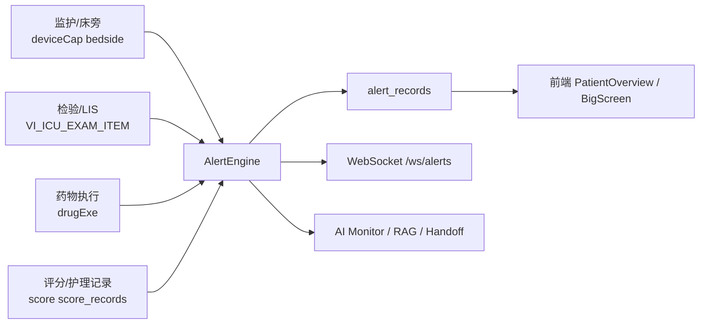

# ICU智能预警系统（ICU Alert System）

面向重症监护病房（ICU）的全栈智能预警平台，整合 **监护设备、检验、药物执行、护理评分、AI 分析**，用于实现实时预警、临床联动与病区可视化。

## 项目亮点

- **多源数据接入**
  - SmartCare：`patient` / `bedside` / `deviceCap` / `drugExe`
  - DataCenter：`VI_ICU_EXAM_ITEM`
- **规则引擎 + 临床综合征识别**
  - 脓毒症、ARDS、AKI、DIC、出血、撤机、VTE、CRRT、谵妄等
- **床旁与病区双视角**
  - 患者详情页、检验时间线、大屏态势、Bundle 合规看板
- **AI 辅助**
  - 风险预测、AI 交班摘要、离线知识检索（RAG）、调用质量监控
- **可落地安全与工程能力**
  - WebSocket 鉴权、CORS 白名单、扫描错峰、全局并发控制、单元测试

---

## 系统架构



---

## 当前核心能力

### 1）生命体征与趋势
- HR / RR / SpO₂ / 血压 / 体温阈值预警
- 趋势恶化识别（线性回归）
- 心律/QTc/容量反应性/呼吸机参数联动

### 2）检验与酸碱分析
- 电解质、乳酸、Hb、PLT、Cr、PCT、INR、BNP、肌钙蛋白等扫描
- 血气自动解读：
  - 主紊乱判断
  - Winter 代偿判断
  - 校正 AG
  - Delta-Delta
  - 乳酸校正 AG
  - **呼吸性酸碱中毒急慢性区分**
  - **Stewart SID 分析**

### 3）综合征识别
- **Sepsis-3**：qSOFA / SOFA Δ / 脓毒性休克
- **ARDS**：P/F + PEEP
- **AKI**：KDIGO（Cr + 尿量）
- **DIC**：ISTH
- **出血风险**
- **谵妄风险 / CAM-ICU 阳性**

### 4）治疗过程监测
- 呼吸机撤机与呼吸力学监测
- CRRT：
  - TMP 趋势
  - ACT / 枸橼酸抗凝监测
  - 剂量不足
  - **滤器时长**
  - **Ca_total / iCa 比值**
  - **电解质复查提醒**
- 药物安全：
  - HIT
  - QT 风险
  - 镇静/阿片相关风险
  - 激素撤离/减停/血糖联动
- 剂量调整：
  - 肾功能不全高危药
  - **肝功能不全高危药**

### 5）护理与流程合规
- GCS / RASS / 疼痛 / CAM-ICU / Braden 超时提醒
- Device management：
  - CVC / Foley / ETT 在位日和必要性评估
- Liberation bundle：
  - A-F Bundle 合规检查
- 转出准备评估：
  - **API 查询 + 主动推送**

### 6）AI 能力
- AI 检验摘要
- AI 规则推荐
- AI 恶化风险预测
- AI 交班摘要（I-PASS）
- 离线知识库检索（RAG）
- **AI 调用监控**
  - hash / latency / success
  - token usage
  - 日聚合统计
  - 成功率/P95 告警

---

## 预警引擎模块

当前后端已包含以下主要模块：

| 模块 | 作用 |
|---|---|
| `vital_signs.py` | 生命体征阈值预警 |
| `lab_scanner.py` | 检验扫描与纠正建议 |
| `trend_analyzer.py` | 生命体征趋势恶化 |
| `syndrome_sepsis.py` | Sepsis-3 / 脓毒性休克 |
| `syndrome_ards.py` | ARDS 识别 |
| `syndrome_aki.py` | AKI 分期 |
| `syndrome_dic.py` | DIC 评分 |
| `syndrome_tbi.py` | ICP / CPP / GCS / 瞳孔 |
| `syndrome_bleeding.py` | 出血识别 |
| `ventilator.py` | 撤机与呼吸机力学监测 |
| `drug_safety.py` | 药物不良反应与联动规则 |
| `antibiotic_stewardship.py` | 抗菌药优化与 PCT 停药评估 |
| `delirium_risk.py` | 谵妄风险 / CAM-ICU |
| `device_management.py` | CVC/Foley/ETT 管路管理 |
| `fluid_balance.py` | 入量/出量/净平衡 |
| `glycemic_control.py` | 血糖波动/低血糖/复查提醒 |
| `vte_prophylaxis.py` | VTE 风险与预防遗漏 |
| `nutrition_monitor.py` | 营养不足/再喂养风险 |
| `composite_deterioration.py` | 多器官恶化趋势 |
| `crrt_monitor.py` | CRRT 运行监测 |
| `liberation_bundle.py` | A-F Bundle 合规 |
| `hemodynamic_advisor.py` | PPV/SVV 容量反应性 |
| `dose_adjustment.py` | 肾/肝功能剂量调整 |
| `discharge_readiness.py` | 转出风险评估 |
| `ai_risk.py` | LLM 结构化风险分析 |
| `nurse_reminder.py` | 护理评估到期提醒 |

---

## 最近一轮重点更新

### 临床准确性
- 血气解读新增：
  - 呼吸性酸碱失衡急/慢性区分
  - Stewart SID 分析
- 血糖 CV 改为 **样本标准差（N-1）**
- PCT 停药评估改为以 **抗生素疗程起始后峰值** 为基线
- CAM-ICU 阳性可直接触发 **critical**

### 监测增强
- CRRT 新增滤器时长、枸橼酸蓄积风险、电解质复查提醒
- VTE 机械预防检测扩大到床旁、医嘱、文本兜底
- 转出评估支持主动扫描推送
- 尿量/出量查询增加 **code 不匹配时的 fallback**

### AI / 检索 / 监控
- RAG 新增医学同义词扩展
- AI Monitor 支持 token usage、聚合统计、阈值告警
- 新增接口：`GET /api/ai/monitor/summary`

### 安全与工程
- CORS 从 `*` 改为白名单
- WebSocket 新增鉴权
- 扫描任务错峰启动
- 新增全局并发控制
- 补充单元测试

### 前端
- 持续进行首屏与大包体积优化
- PatientOverview / BigScreen / App 壳层 / router 首屏 chunk 已继续拆分与懒加载

---

## 快速开始

## 1. 环境准备

- Python 3.11+
- Node.js 18+
- MongoDB 4.4+
- Redis（可选）

## 2. 后端启动

```bash
cd backend
copy .env.example .env
pip install -r requirements.txt
python -m uvicorn app.main:app --host 0.0.0.0 --port 8000
```

## 3. 前端启动

```bash
cd frontend
npm install
npm run dev -- --host 0.0.0.0 --port 5173
```

## 4. Windows 一键脚本

- `run-dev.bat`：前后端 + 自动安装依赖
- `run-dev-fast.bat`：快速启动
- `run-dev-open.bat`：快速启动并自动打开浏览器

---

## 配置说明

### 环境变量

见 `backend/.env.example`，核心包括：

- 数据库：`SMARTCARE_DB_*`、`DATACENTER_DB_*`
- Redis：`REDIS_HOST` / `REDIS_PORT`
- LLM：`LLM_BASE_URL` / `LLM_API_KEY` / `LLM_MODEL`
- 安全：`SECRET_KEY`
- 可选：
  - `CORS_ALLOWED_ORIGINS`
  - `WEBSOCKET_TOKENS`
  - `WEBSOCKET_REQUIRE_TOKEN`

### YAML 业务配置

主配置文件：`backend/config.yaml`

可配置内容包括：
- 监护参数编码映射
- 检验项识别
- 药物关键词
- 扫描周期
- Bundle/VTE/CRRT/营养/转出评估阈值
- RAG 同义词映射
- AI monitor 阈值

---

## 主要接口

### 基础接口
- `GET /health`
- `GET /api/departments`
- `GET /api/patients`
- `GET /api/patients/{id}`
- `GET /api/patients/{id}/alerts`
- `GET /api/alerts/recent`
- `GET /api/alerts/stats`

### 患者详情
- `GET /api/patients/{id}/vitals`
- `GET /api/patients/{id}/vitals/trend`
- `GET /api/patients/{id}/labs`
- `GET /api/patients/{id}/drugs`
- `GET /api/patients/{id}/assessments`
- `GET /api/patients/{id}/discharge-readiness`

### AI / 知识库
- `GET /api/patients/{id}/handoff-summary`
- `GET /api/ai/lab-summary/{id}`
- `GET /api/ai/rule-recommendations/{id}`
- `GET /api/ai/risk-forecast/{id}`
- `POST /api/ai/feedback`
- `GET /api/ai/monitor/summary`
- `GET /api/knowledge/status`
- `GET /api/knowledge/documents`
- `GET /api/knowledge/documents/{doc_id}`
- `GET /api/knowledge/chunks/{chunk_id}`
- `POST /api/knowledge/reload`

### WebSocket
- `WS /ws/alerts`

> 若启用 WebSocket token 鉴权，请通过 `Authorization: Bearer <token>`、`x-ws-token` 或 query 参数传入。

---

## 测试

后端测试：

```bash
cd backend
.\.venv\Scripts\python.exe -m unittest discover -s tests -v
```

语法检查：

```bash
cd backend
.\.venv\Scripts\python.exe -m compileall app
```

---

## 部署建议

- 生产环境务必修改 `SECRET_KEY`
- 建议配置 `CORS_ALLOWED_ORIGINS`
- 若前端通过 WebSocket 接入，建议配置 `WEBSOCKET_TOKENS`
- 建议为 MongoDB 中 `alert_records`、`score_records`、`ai_monitor_logs` 等集合建立索引（系统已自动创建部分）
- 医院落地前建议先校准：
  - bedside / deviceCap 参数编码
  - 药品命名习惯
  - 检验项目命名与单位

---

## 仓库说明

- 后端：`backend/`
- 前端：`frontend/`
- 启动脚本：根目录 `run-dev*.bat`

如需继续扩展本地院内版本，可优先从以下入口调整：

- 规则与阈值：`backend/config.yaml`
- 规则实现：`backend/app/alert_engine/`
- API：`backend/app/main.py`
- 前端页面：`frontend/src/`

