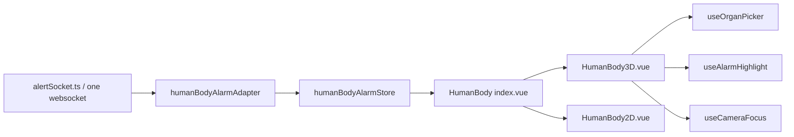

# ICU HumanBody Organ Alarm Visualization

## Architecture

## Data Flow

- The existing alert websocket remains the only realtime channel.
- `humanBodyAlarmAdapter` subscribes to `organ_alarm` and normalizes `{ organ, level, metric, value, patient_id }`.
- `humanBodyAlarmStore` keeps alarms by organ and patient.
- `<HumanBody />` without `patientId` renders aggregated department alarms, taking the highest priority per organ.
- `<HumanBody :patient-id="id" />` renders only that patient.
- `VITE_USE_MOCK=true` skips websocket subscription and pushes local mock alarms every 8 seconds.

## Adding An Organ

1. Add the business name to `src/types/organ.ts`.
2. Add mesh, svg selector, and Chinese label in `src/components/HumanBody/constants/organMap.ts`.
3. Name the GLB mesh according to `mesh`.
4. Add a matching SVG path id in `public/models/human_body.svg` and `HumanBody2D.vue`.
5. Add an organMap unit test.

## Alarm Colors

Edit `src/components/HumanBody/constants/alarmLevels.ts`.

- `critical`: red, 2Hz blink.
- `warning`: orange, 1Hz blink.
- `info`: yellow, 0.5Hz blink.
- `selected`: cyan, no blink.

## Performance Checklist

- Draco-compressed high GLB under 8 MB.
- Low GLB under 2 MB.
- Triangle count under 400k for high model.
- Draw calls under 50.
- No DOM reads/writes inside requestAnimationFrame.
- Dispose geometries, materials, textures, controls, renderer, and GSAP tweens on unmount.
- Use `?force=2d` to verify low-end fallback.
- If 3D FPS stays under 25 for 5 seconds, `HumanBody` emits `performance-degraded` and falls back to SVG.

## Demo

Open `/demo/human-body`.

- `?force=2d`: SVG fallback.
- `?force=low`: low GLB path.
- `?force=high`: high GLB path.

The demo provides manual alarm buttons and single-patient mode for acceptance testing.

## Known Limits

- Real GLB assets are not committed. The 3D component uses procedural placeholder organs when GLB loading fails.
- Backend `organ_alarm` wire shape is marked TODO in `humanBodyAlarmAdapter`; current adapter accepts common aliases.
- BigScreen integration uses the existing bed grid and alert feed; richer organ-filtered feed behavior can be added later.
